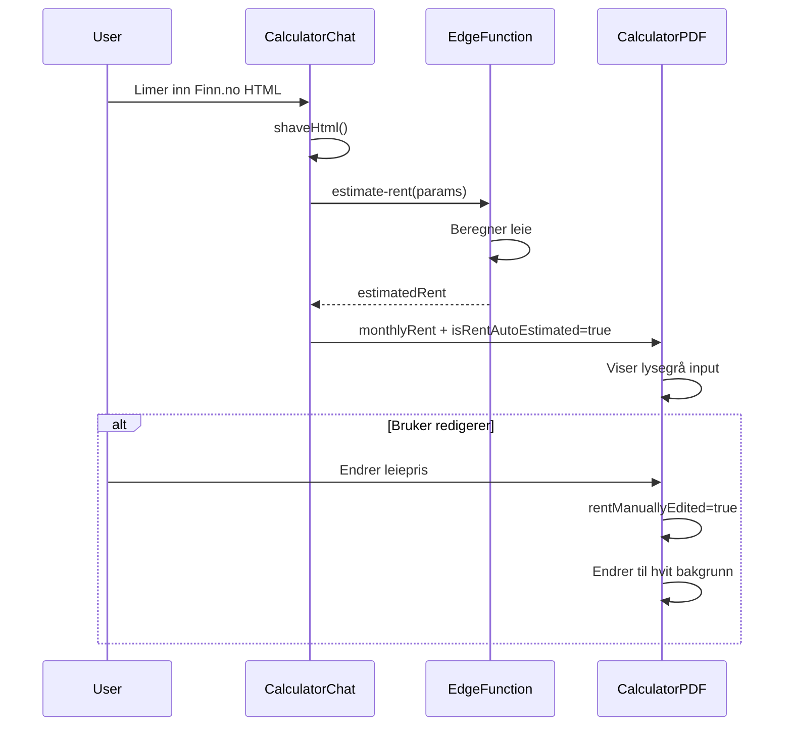

# Automatisk Leiepris-estimering

## Oversikt

Systemet estimerer automatisk månedlig leiepris basert på data ekstrahert fra Finn.no HTML. Estimeringslogikken er inspirert av metoden brukt på husleie.no.

## Funksjonalitet

### 1. Automatisk Estimering
- **Trigges**: Når HTML fra Finn.no er parsed
- **Kjøres i bakgrunnen**: Bruker trenger ikke gjøre noe
- **Fyller ut**: "Månedlig leieinntekt" i PDF-rapporten
- **Indikator**: Lysegrå bakgrunn + "(estimert)" label

### 2. Manuell Overstyring
- **Bruker kan**: Klikke og endre estimert verdi
- **Visuell endring**: Bakgrunn går fra lysegrå til hvit
- **Indikator fjernes**: "(estimert)" label forsvinner
- **For banken**: Hvit bakgrunn viser at det er manuelt input

## Teknisk Implementering

### Edge Function: estimate-rent

**Lokasjon**: `supabase/functions/estimate-rent/index.ts`

**Input Parametere**:
```typescript
{
  postalCode: string;
  municipality: string;
  propertyType: string; // 'Leilighet', 'Enebolig', etc.
  bedrooms: number;
  primarySize: number; // m²
  furnished?: boolean;
  parking?: boolean;
  utilities?: boolean; // strøm og vann inkludert
}
```

**Output**:
```typescript
{
  estimatedRent: number;
  confidence: 'low' | 'medium' | 'high';
  methodology: 'simplified';
  breakdown: {
    basePricePerSqm: number;
    size: number;
    baseRent: number;
    addons: {
      furnished: number;
      parking: number;
      utilities: number;
    }
  }
}
```

### Estimeringslogikk

#### 1. Base Pris per m²
```typescript
let basePricePerSqm = 150; // Default NOK per m²
```

#### 2. Eiendomstype-multiplikator
```typescript
const multipliers = {
  'Leilighet': 1.0,
  'Enebolig': 0.85,
  'Rekkehus': 0.9,
  'Tomannsbolig': 0.85,
  'Hybel': 1.3 // Høyere per m², men mindre størrelse
};
```

#### 3. Lokasjonsjustering
- **Oslo (0xxx)**: +50% (basePricePerSqm *= 1.5)
- **Bergen (5xxx)**: +30% (basePricePerSqm *= 1.3)
- **Trondheim (7xxx)**: +25% (basePricePerSqm *= 1.25)
- **Stavanger (4xxx)**: +30% (basePricePerSqm *= 1.3)
- **Andre**: Ingen justering

#### 4. Størrelsejustering
- **Under 40m²**: +20% (sizeAdjustment = 1.2)
- **Over 100m²**: -10% (sizeAdjustment = 0.9)
- **40-100m²**: Ingen justering

#### 5. Soverom-bonus
```typescript
const bedroomBonus = Math.max(0, bedrooms - 1) * 1000;
basePricePerSqm += bedroomBonus / primarySize;
```

#### 6. Tillegg
- **Møblert**: +15% av base leie
- **Parkering**: +1,500 kr
- **Strøm/vann inkludert**: +1,000 kr

#### 7. Avrunding
```typescript
estimatedRent = Math.round(estimatedRent / 100) * 100; // Til nærmeste 100
estimatedRent = Math.max(estimatedRent, 5000); // Min 5,000 kr
```

### Frontend Integration

#### CalculatorChat.tsx

**Auto-fylling ved HTML parsing**:
```typescript
// After shaveHtml()
const rentEstimateData = {
  postalCode: result.preview.postalCode,
  municipality: result.preview.municipality,
  propertyType: result.preview.propertyType,
  bedrooms: result.preview.bedrooms,
  primarySize: result.preview.primarySize,
  furnished: false,
  parking: result.preview.facilities?.some(f => 
    f.toLowerCase().includes('parkering')
  ),
  utilities: false
};

const { data: rentData } = await supabase.functions.invoke('estimate-rent', {
  body: rentEstimateData
});

if (rentData?.estimatedRent) {
  onDataUpdate?.('monthlyRent', rentData.estimatedRent.toString());
  onDataUpdate?.('isRentAutoEstimated', true);
}
```

#### CalculatorPDFPreview.tsx

**Visuell indikator**:
```typescript
const [rentManuallyEdited, setRentManuallyEdited] = useState(false);

// In PrintableInput component
const inputClassName = isAutoEstimated && !rentManuallyEdited
  ? "mt-1 rounded-none h-8 bg-gray-100 border-gray-300" // Lysegrå
  : "mt-1 rounded-none h-8"; // Hvit (standard)

// In handleChange
if (field === 'monthlyRent') {
  setRentManuallyEdited(true);
  onDataChange?.('isRentAutoEstimated', false);
}
```

**Label med indikator**:
```tsx
<Label>
  Månedlig leieinntekt
  {formData.isRentAutoEstimated && !rentManuallyEdited && (
    <span className="ml-2 text-xs text-gray-500 font-normal">
      (estimert)
    </span>
  )}
</Label>
```

## Dataflyt



## Bruksscenario

### Scenario 1: Automatisk Estimering
1. **Bruker**: Limer inn Finn.no HTML
2. **System**: Parser data (adresse, størrelse, soverom, etc.)
3. **System**: Kaller `estimate-rent` edge function
4. **System**: Fyller ut "17 500 kr" i leieinntekt-felt
5. **Visuell**: Lysegrå bakgrunn + "(estimert)" label
6. **For banken**: Klart at dette er system-estimert verdi

### Scenario 2: Manuell Override
1. **Bruker**: Ser estimert pris er for lav
2. **Bruker**: Klikker på feltet og endrer til "20 000 kr"
3. **System**: Endrer bakgrunn til hvit
4. **System**: Fjerner "(estimert)" label
5. **For banken**: Klart at dette er bruker-spesifisert verdi

### Scenario 3: Ingen Estimering
1. **System**: Kunne ikke estimere (manglende data)
2. **Felt**: Tomt med hvit bakgrunn
3. **Bruker**: Fyller inn manuelt
4. **For banken**: Standard manuell input

## Nøyaktighet

### Konfidensevurdering
Systemet returnerer en confidence-score:
- **High**: Alle parametere tilgjengelig, kjent lokasjon
- **Medium**: Noen parametere mangler, generisk estimering
- **Low**: Minimalt med data, stor usikkerhet

### Begrensninger
- **Forenklet modell**: Bruker ikke reelle markedsdata
- **Statisk**: Ingen sanntids prisjusteringer
- **Generisk**: Tar ikke hensyn til:
  - Nabolag-kvalitet
  - Renovering/tilstand
  - Utsikt/etasje
  - Sesongvariasjon
  - Markedstrender

### Forbedringspotensiale
- Integrasjon med husleie.no API (hvis tilgjengelig)
- Machine learning på historiske data
- Finn.no leiepris-data scraping
- Brukerfeedback loop for forbedring

## Fremtidige Forbedringer

### Planlagt
- [ ] Integrasjon med husleie.no API
- [ ] ML-modell trent på reelle data
- [ ] Bruker kan velge "møblert" før estimering
- [ ] Historikk av estimater med faktisk oppnådd pris

### Under Vurdering
- [ ] A/B testing av forskjellige estimeringsmetoder
- [ ] Crowdsourced data fra Leily-brukere
- [ ] Real-time markedsdata fra SSB
- [ ] Prediktiv modell for fremtidig leiepris

## Relatert Dokumentasjon

- [Ny Kalkulator System](./new-calculator-system.md)
- [CalculatorChat Component](../../src/components/calculator/CalculatorChat.tsx)
- [CalculatorPDFPreview Component](../../src/components/calculator/CalculatorPDFPreview.tsx)
- [estimate-rent Edge Function](../../supabase/functions/estimate-rent/index.ts)
