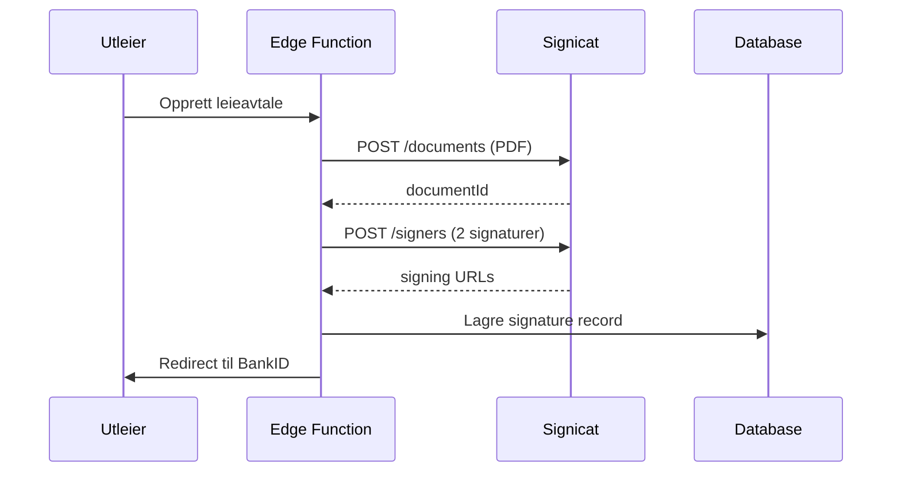
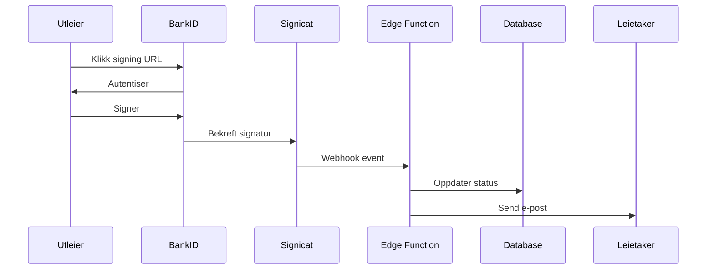
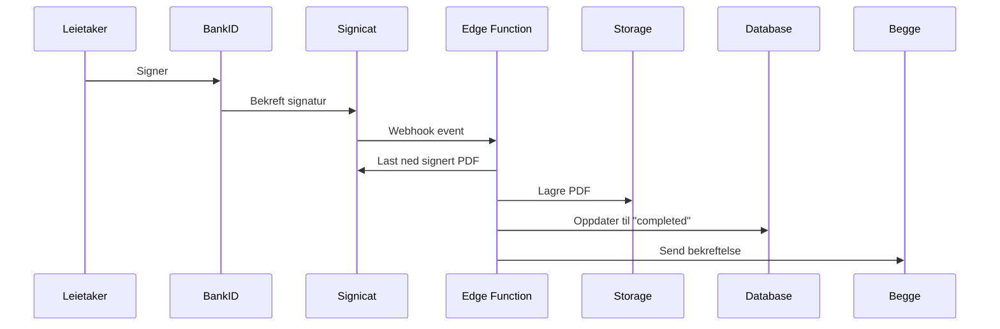

# Signicat BankID Integration

## Status: ⚠️ Ikke aktivert (Mock-modus)

Systemet fungerer i mock-modus uten Signicat. Følg denne guiden for å aktivere ekte BankID-signering.

## Oversikt
Signicat brukes for elektronisk signering av leieavtaler med norsk BankID.

## Fordeler
- **Juridisk bindende:** BankID-signatur er godkjent av norske myndigheter
- **Sikker:** To-faktor autentisering via bank
- **Enkel:** Brukere har allerede BankID
- **Sporbar:** Full audit trail av alle signeringer
- **Mobilvenlig:** Fungerer på alle enheter

## Setup (Trinn-for-trinn)

### 1. Opprett Signicat Konto
1. Gå til https://developer.signicat.com/
2. Klikk "Get Started" eller "Sign Up"
3. Registrer deg med e-post
4. Verifiser e-postadressen din

### 2. Opprett Application
1. Logg inn på Signicat Developer Portal
2. Gå til "Applications"
3. Klikk "Create Application"
4. Navn: `Leily Production`
5. Type: `Signature Service`
6. Redirect URLs: 
   - `https://leily.no/lease/:id/signature`
   - `https://stage.leily.no/lease/:id/signature` (hvis staging)

### 3. Hent API Credentials
1. I Application-innstillingene, finn:
   - **Client ID** (starter med `sig_`)
   - **Client Secret** (hemmelighet - lagres kun i Supabase)
   - **Account ID** (finn under Account Settings)
2. Kopier disse verdiene

### 4. Sett opp Webhook
1. I Application-innstillingene, gå til "Webhooks"
2. Legg til ny webhook:
   - URL: `https://wdwjmapvuibsqiifslno.supabase.co/functions/v1/signicat-signing/webhook`
   - Events: Velg alle `document.*` events
   - Secret: Generer en random string (min 32 tegn)

### 5. Legg til Secrets i Supabase
1. Gå til Supabase Dashboard → Project Settings → Edge Functions
2. Legg til følgende secrets:

```bash
# Fra Signicat Developer Portal
SIGNICAT_CLIENT_ID=sig_xxxxxxxxxxxxx
SIGNICAT_CLIENT_SECRET=xxxxxxxxxxxxxxxxxxxxxxxxxxxxx
SIGNICAT_ACCOUNT_ID=acc_xxxxxxxxxxxxx

# Self-generated webhook secret (min 32 characters)
SIGNICAT_WEBHOOK_SECRET=your-random-secret-min-32-chars
```

**Viktig:** Bruk "Add Secret" knappen i Supabase, **IKKE** legg dem i .env filer!

### 6. Test i Sandbox
Signicat har et test-miljø:
1. Gå til Developer Portal → Environments
2. Velg "Sandbox"
3. Test med test-BankID (får test-credentials fra Signicat)
4. Verifiser at hele flyten fungerer

### 7. Søk om Produksjon
1. Når testing er OK, søk om produksjonstilgang
2. Signicat vil gjennomgå søknaden (kan ta noen dager)
3. Du får produksjons-credentials
4. Bytt secrets i Supabase til produksjonsversjoner

## Hvordan Systemet Fungerer

### Current: Mock Mode
**Uten Signicat-konfigurasjon:**
```typescript
// Edge Function detekterer manglende config
if (!signicatConfigured) {
  console.log('⚠️ Signicat not configured - using mock mode');
  return await createMockSignatureRequest(...);
}
```

**Resultat:**
- Leieavtaler opprettes normalt
- Mock document ID genereres
- Mock signing URLs opprettes
- Database oppdateres som vanlig
- E-post sendes til leietaker
- **Men:** Ingen ekte BankID-signering

### After Activation: Real BankID
**Med Signicat-konfigurasjon:**
```typescript
// Edge Function bruker ekte Signicat API
const accessToken = await getSignicatAccessToken();
const document = await createDocument(pdfData);
await addSigners(landlord, tenant);
await activateDocument();
```

**Resultat:**
- Ekte BankID-signering
- Juridisk bindende avtaler
- Signert PDF lastes ned automatisk
- Full audit trail

## API Flow (Når Aktivert)

### 1. Opprett Signatur


### 2. Signering


### 3. Fullføring


## Kostnader

### Signicat Prising
**Må avklares direkte med Signicat:**
- Kontakt: sales@signicat.com
- Telefon: +47 21 93 00 00

**Typisk prisstruktur:**
- Setup fee: 0 - 5,000 kr (engangsbeløp)
- Per signatur: 5-15 kr (avhenger av volum)
- Månedlig minimum: Kan være 0-1000 kr

**Volume discounts:**
- < 100 signaturer/måned: ~10-15 kr/signatur
- 100-500 signaturer/måned: ~5-10 kr/signatur
- > 500 signaturer/måned: ~3-5 kr/signatur

**For Leily:**
- Anslått 50-200 leieavtaler/måned
- 2 signaturer per avtale = 100-400 signaturer
- Estimert kostnad: 1,000 - 4,000 kr/måned

## Testing

### Mock Mode (Current)
```bash
# Test edge function uten Signicat
curl -X POST https://wdwjmapvuibsqiifslno.supabase.co/functions/v1/signicat-signing/create-signature-request \
  -H "Authorization: Bearer [anon-key]" \
  -H "Content-Type: application/json" \
  -d '{"leaseId": "test-lease-id"}'

# Response:
# {
#   "success": true,
#   "mock": true,
#   "message": "Signicat not configured - using mock mode"
# }
```

### Sandbox Mode (Testing)
```bash
# Test med Signicat Sandbox
# (samme endpoint, men med SIGNICAT_* secrets satt til sandbox-verdier)
```

### Production Mode
```bash
# Test med ekte produksjons-credentials
# (samme endpoint, men med production secrets)
```

## Sikkerhet

### Webhook Signature Validation
```typescript
// Valider at webhook kommer fra Signicat
const webhookSecret = Deno.env.get('SIGNICAT_WEBHOOK_SECRET');
const signature = req.headers.get('x-signicat-signature');

// Implement HMAC validation
const expectedSignature = await crypto.subtle.sign(
  'HMAC',
  key,
  encoder.encode(payload)
);

if (signature !== expectedSignature) {
  throw new Error('Invalid webhook signature');
}
```

### RLS Policies
```sql
-- Kun property owner kan se signaturer
CREATE POLICY "Users can manage own lease signatures"
  ON lease_signatures
  FOR ALL
  USING (
    lease_id IN (
      SELECT id FROM lease_agreements 
      WHERE property_owner_id = auth.uid()
    )
  );
```

## Feilsøking

### "Signicat not configured" Melding
**Årsak:** SIGNICAT_* secrets mangler  
**Løsning:** Legg til secrets i Supabase (se Setup steg 5)

### "Invalid credentials" Error
**Årsak:** Feil Client ID/Secret  
**Løsning:** Verifiser credentials i Signicat Developer Portal

### "Webhook signature invalid"
**Årsak:** Feil SIGNICAT_WEBHOOK_SECRET  
**Løsning:** Bruk samme secret i både Signicat og Supabase

### "Document creation failed"
**Årsak:** PDF-generering feilet  
**Løsning:** Sjekk `generate-lease-pdf` Edge Function logs

## Migrering fra Mock til Production

### Steg 1: Legg til Secrets
```bash
# I Supabase Dashboard
SIGNICAT_CLIENT_ID=sig_prod_xxxxx
SIGNICAT_CLIENT_SECRET=prod_secret_xxxxx
SIGNICAT_ACCOUNT_ID=acc_prod_xxxxx
SIGNICAT_WEBHOOK_SECRET=your-prod-webhook-secret
```

### Steg 2: Test i Staging
```bash
# Deploy til staging med nye secrets
# Test full signerings-flyt
# Verifiser at begge signaturer fungerer
```

### Steg 3: Aktiver i Production
```bash
# Deploy til production
# Overvåk Edge Function logs
# Test med ekte leieavtale
```

### Steg 4: Kommuniker til Brukere
```
Vi har nå aktivert BankID-signering! 🎉

Leieavtaler signeres nå med:
✓ Norsk BankID
✓ Juridisk bindende
✓ Fullt digitalt
✓ Enklere enn noensinne

Ingen endringer i brukeropplevelsen - 
det fungerer bare bedre! 🚀
```

## Dokumentasjon Lenker
- Developer Portal: https://developer.signicat.com/
- API Docs: https://developer.signicat.com/docs/signature/
- Signature Guide: https://developer.signicat.com/docs/signature/getting-started/
- Webhook Docs: https://developer.signicat.com/docs/signature/webhooks/
- Support: https://support.signicat.com/

## Support Kontakt
- E-post: support@signicat.com
- Telefon: +47 21 93 00 00
- Developer Support: developer@signicat.com

---

**Sist oppdatert:** 2025-01-03  
**Status:** Mock-modus aktiv - Venter på Signicat setup  
**Vedlikeholdes av:** Leily Development Team
